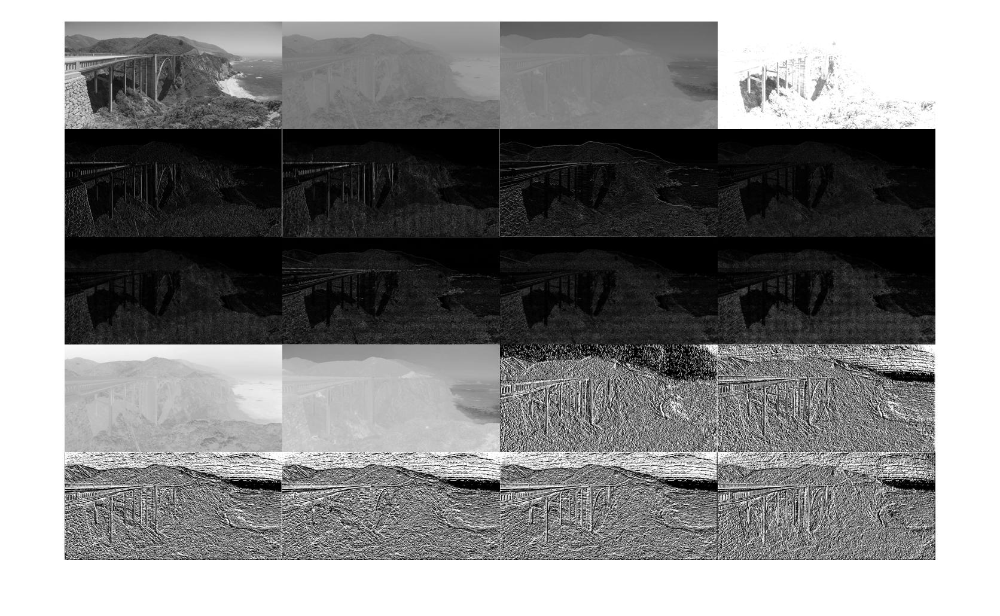
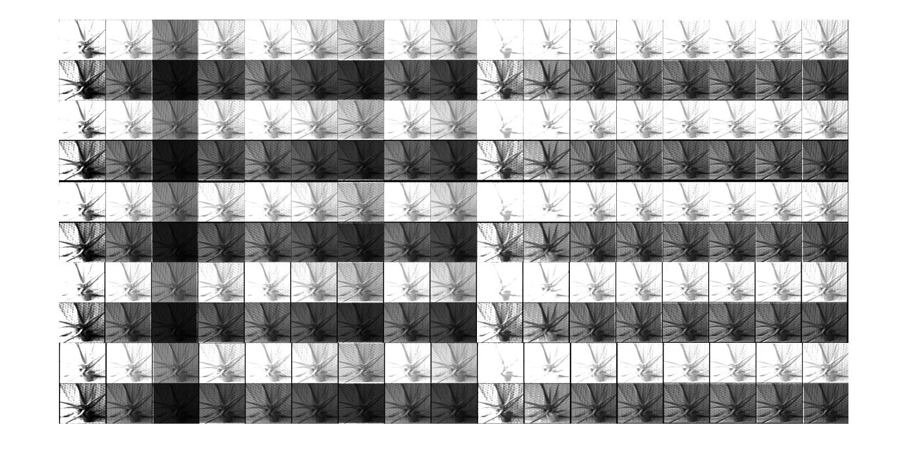
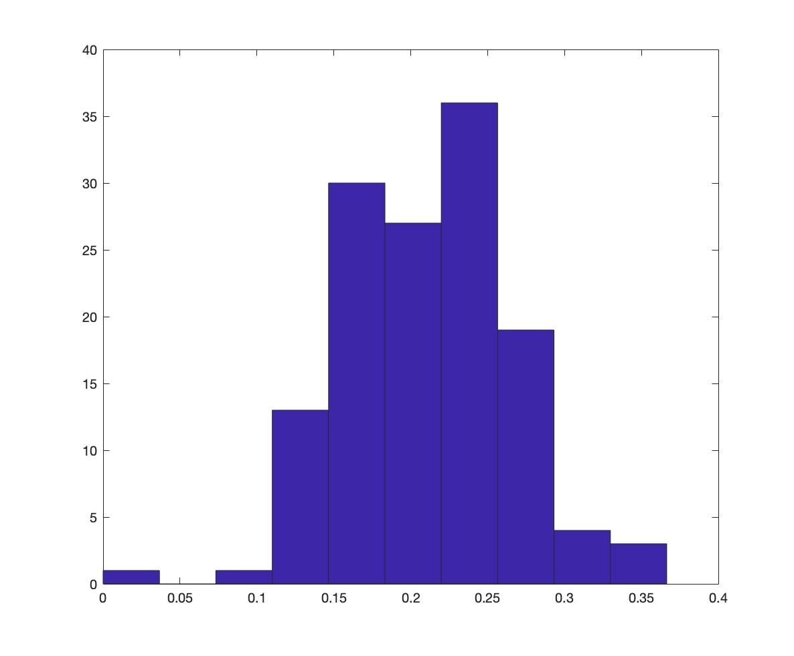

# Monocular Depth Estimation

A monocular depth estimation system using graphical model techniques. Patch-level texture features are computed to estimate absolute depths at particular image patches, as well as relative depth comparisons. The depths are modeled as a Gaussian Markov Random Field, with depth values considered at three different scales to simulate depth relationships between objects. A maximum likelihood estimate for the parameters is obtained by solving a linear least squares problem. Finally, prediction of depth for a test image is achieved by finding a MAP estimate for the depths in the graphical model. Because the log-likelihood is quadratic in depth values, the MAP estimate can be obtained in closed form.

## Algorithm

One approach to monocular depth estimation combines local (absolute) and global (relative) information from the image to predict depths. Saxena et al. estimate depth values for patches of an image by using absolute depth features---which incorporate local information about the depth of a patch---and relative depth features, which compare aspects of different patches of the same image to infer relative depth of patches.

Another approach is to use the semantic content of the image as input to the depth estimation. Liu et al. use a two-phase approach, first performing semantic segmentation of the image, labeling each pixel as one of seven classes like sky or water.

We began by computing pixel-level features to represent texture gradients and color in the image. After converting the image to YCbCR colorspace, we apply 3x3 Law's masks to the intensity channel, then we apply the first Law's mask to both the Cb and Cr color channels to model haze in the image.

To model contextual relationships, we append the 34 patch-level features of a given patch's 4-neighbors to the patch, creating a 170-dimensional vector. We repeat this process twice more, at scales of 3x and 9x (60x60 and 180x180 patches, respectively). The scaled features are matched back to their corresponding patch and are added to the feature vector for each patch, yielding a 510-dimensional feature vector for each patch.

To model the interactions between depth values of neighbouring patches we use a Markov Random Field (MRF). However, one more thing that needs to be taken into account is the interaction of depth values of patches that are not immediate neighbours, that is because sometimes there is a strong interaction between patches that are not immediate neighbours. For example, patches that belong to a large object (sky, building, etc..) will have similar depths even though they might not be immediate neighbours. For this, we model interactions between depths at multiple spatial scales because some adjacent patches when viewed at smaller scales are difficult to recognize as parts of the same object.

## Results

We tested our algorithm on Make3D Test Data set, consisting of 134 images from the Make3D dataset. Similar to the training dataset, all photos are different outdoor settings around a college campus. Figure \ref{fig:depths} shows some examples of photos from the test set alongside ground truth depth data and the output of our model.

We observe that the model predicts with good accuracy the general structure of the depth map, but is not able to clearly distinguish objects or represent occlusions.

